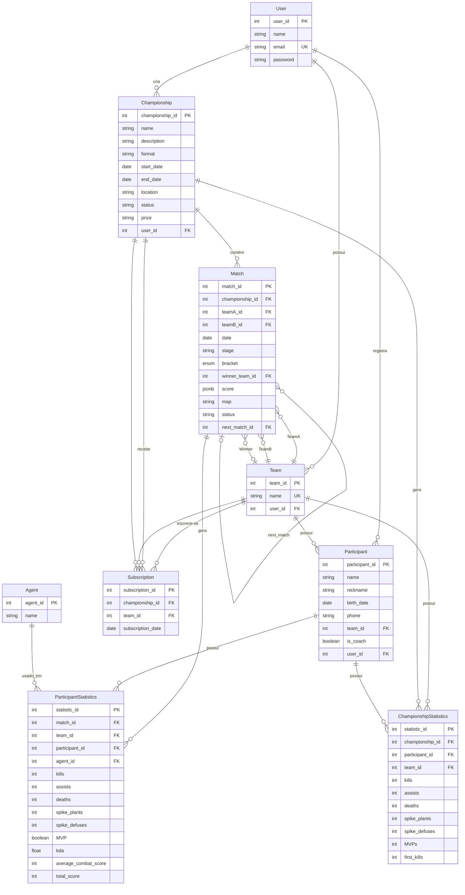
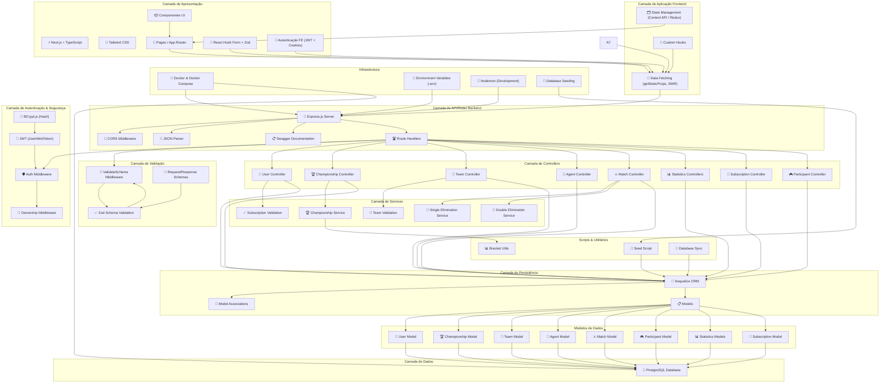

# Repositório Central - Grupo A (AS66A-N16)
Este repositório reúne os documentos e artefatos produzidos durante o desenvolvimento de um sistema computacional para gestão de campeonatos do jogo Valorant, como parte da disciplina Certificadora de Competência Específica (CCE) do sexto período do curso de Análise e Desenvolvimento de Sistemas (UTFPR).

A disciplina tem como objetivo integrar os conhecimentos adquiridos ao longo da formação, por meio do desenvolvimento de um sistema que resolva um problema real. Além da entrega do produto final, o projeto avalia competências como gestão de projetos, levantamento de requisitos com cliente, modelagem de software, uso de ferramentas colaborativas, documentação, e aplicação de metodologias contemporâneas de desenvolvimento.

## Sobre o Projeto

A solução proposta pelo Grupo A é uma plataforma web para gerenciar campeonatos de Valorant, que centraliza o cadastro de jogadores e equipes, organiza partidas e fornece relatórios e dashboards informativos. O sistema conta com diferentes interfaces para organizadores e para o público geral, promovendo uma experiência completa e acessível.

**Funcionalidades Principais:**

- Cadastro e Gerenciamento: Registro de jogadores, equipes e campeonatos.
- Gestão de Campeonatos: Configuração de torneios com diferentes formatos (eliminatória simples e dupla).
- Automatização e Paineis: Classificação automática (sistema de chaveamento) e paineis com os dados estatísticos do andamento do campeonato.
- Interfaces Diferenciadas: Áreas administrativas e públicas voltadas para organizadores e fãs.

**Repositórios Relacionados:**
- Repositório Backend: https://github.com/Matari73/Backend-CCE-AS66A
- Repositório Frontend: https://github.com/Pedroooxx/frontend-grupo-a-cce 

## Diagrama de Entidade Relacionamento

## Diagrama de Arquitetura

