# Valorant Tournament Management System 🎮


## Table of Contents
- [Valorant Tournament Management System 🎮](#valorant-tournament-management-system-)
  - [Table of Contents](#table-of-contents)
  - [Overview](#overview)
    - [Core Features](#core-features)
    - [Related Repositories](#related-repositories)
  - [Architecture \& Design](#architecture--design)
    - [Architecture](#architecture)
    - [DER](#der)
    - [Class Diagram](#class-diagram)
    - [Data Flow Diagram](#data-flow-diagram)
  - [Technology Stack](#technology-stack)
    - [Frontend Architecture](#frontend-architecture)
    - [Backend Architecture](#backend-architecture)
  - [Development Setup](#development-setup)
    - [Prerequisites](#prerequisites)
    - [Quick Start](#quick-start)
  - [Team \& Documentation](#team--documentation)
    - [Development Team](#development-team)
    - [Documentation](#documentation)

## Overview
A comprehensive web platform for managing Valorant tournaments, developed as part of the CCE (Specific Competence Certification) course at UTFPR.

### Core Features
- **User Management:** Authentication, roles, and profiles
- **Tournament Organization:** Creation and management of events
- **Team Management:** Registration and roster control
- **Match System:** Scheduling and results tracking
- **Statistics & Analytics:** Performance metrics and reports
- **Public Interface:** Tournament viewing and results

### Related Repositories
- [Backend Repository](https://github.com/Matari73/Backend-CCE-AS66A)
- [Frontend Repository](https://github.com/Pedroooxx/frontend-grupo-a-cce)

## Architecture & Design

### Architecture

```mermaid

flowchart TB
  %% Camadas do Sistema
  subgraph "Camada de Apresentação"
    direction TB
    A1["⚡ Next.js + TypeScript"]
    A2["💅 Tailwind CSS"]
    A3["📦 Componentes UI"]
    A4["📁 Pages / App Router"]
    A5["📝 React Hook Form + Zod"]
    A6["🔐 Autenticação FE (JWT + Cookies)"]
    A7["📊 Componentes de Gráfico"]
  end

  subgraph "Camada de Aplicação"
    direction TB
    B1["🔄 Data Fetching (getStaticProps, SWR)"]
    B2["🗂️ State Management (Context API / Redux)"]
    B3["🔗 Custom Hooks"]
  end

  subgraph "Camada de API"
    direction TB
    C1["📡 Express.js API REST"]
    C2["🔐 Bcrypt + JWT"]
    C3["🧪 Middlewares (JWT + Zod/Joi)"]
  end

  subgraph "Camada de Persistência"
    direction TB
    D1["🧬 Sequelize ORM"]
    D2["📘 Models: Usuário, Equipe, Participante, …"]
  end

  subgraph "Camada de Dados"
    direction TB
    E1["🐘 PostgreSQL"]
  end

  subgraph "Infraestrutura"
    direction TB
    F1["🐳 Docker & Docker Compose"]
    F2["📄 .env"]
  end

  subgraph "Integrações Externas"
    direction TB
    G1["🌐 QuickChart API"]
  end

  %% Fluxos
  A4 --> B1
  A3 --> A4
  A5 --> B1
  A6 --> B1
  A7 --> B1
  B1 --> C1
  B2 --> A4
  B3 --> B1
  C1 --> C2
  C1 --> C3
  C1 --> D1
  C1 --> G1
  D1 --> D2
  D2 --> E1
  F1 --> C1
  F1 --> E1
  F2 --> C1

```



### DER


---

### Class Diagram


### Data Flow Diagram

```mermaid
%%=====================  DATA FLOW 0  =======================
flowchart LR
    %% ——— External Users ———
    subgraph Users
        O[Organizador]
        F[Fã / Jogador]
    end

    %% ——— Frontend Layer ———
    subgraph Web["Frontend"]
        UI[Next.js UI]
    end

    %% ——— API Layer ———
    subgraph Api["Express API"]
        CTR[Controllers]
        SVC[Services]
    end

    %% ——— ORM Layer ———
    subgraph ORM["Sequelize ORM"]
        ORMProc[(ORM)]
    end

    %% ——— Data Stores & External Service ———
    DB[(PostgreSQL)]
    EXT[(Chart)]

    %% ——— Data Flows ———
    O   -- CRUD --> UI
    F   -- Visualiza --> UI
    UI  -- JSON --> CTR
    CTR -- Rules --> SVC
    SVC -- ORM calls --> ORMProc
    ORMProc -- SQL --> DB
    SVC -- Charts --> EXT
    EXT -- PNG --> SVC
    SVC -- Data --> CTR
    CTR -- JSON --> UI

    %% ——— Styling for Data Stores ———
    classDef stores fill:#ffe0b2,stroke:#ff9800;
    class DB,EXT stores;
```




## Technology Stack

### Frontend Architecture
- **Framework:** Next.js v15.3.2  
- **Library:** React v19.0.0 + React-DOM v19.0.0  
- **Styling:** Tailwind CSS v4.1.5 + PostCSS v8.5.3  
- **Linting:** ESLint v9.x + `eslint-config-next` v15.3.2  
- **TypeScript:** v5.x  
- **Package Manager:** npm

### Backend Architecture
- **Runtime:** Node.js v20.x (ESM)  
- **Framework:** Express.js v5.1.0  
- **ORM:** Sequelize v6.37.7 with `pg` v8.15.6 + `pg-hstore` v2.3.4  
- **Auth & Security:** `jsonwebtoken` v9.0.2 + `bcryptjs` v3.0.2  
- **Validation:** Zod v3.24.4  
- **Env Management:** dotenv v16.5.0  
- **Dev Tooling:** nodemon v3.1.10

## Development Setup

### Prerequisites
```bash
# Required versions
node >= 20.0.0
npm  >= 9.0.0
postgresql >= 15.0

```

### Quick Start

# Clone repositories

```bash
git clone https://github.com/Matari73/Backend-CCE-AS66A
git clone https://github.com/Pedroooxx/frontend-grupo-a-cce
```

# Backend setup
```bash

cd Backend-CCE-AS66A
cp .env.example .env
docker compose down
docker compose up --build
```

# Frontend setup

```bash
cd ../frontend-grupo-a-cce
npm install
cp .env.example .env.local
npm run dev
```

## Team & Documentation

### Development Team
- **Backend & Database**
  - Mariana de Oliveira
  - Giovana Araújo Hoffmann
  - Italo Pereira Ventura
- **Frontend & UI**
  - Pedro de Oliveira Machado
  - Sérgio Alexandre Alvarenga de Almeida

### Documentation
- [Project Proposal](../fase_1/)
- [API Documentation](https://api-docs.valorant-tournament.dev)
- [Contributing Guidelines](CONTRIBUTING.md)

