# Valorant Tournament Management System 🎮


## Table of Contents
- [Valorant Tournament Management System 🎮](#valorant-tournament-management-system-)
  - [Table of Contents](#table-of-contents)
  - [Overview](#overview)
  - [Architecture \& Design](#architecture--design)
    - [Architecture Diagram](#architecture-diagram)
    - [Entity-Relationship Diagram](#entity-relationship-diagram)
    - [Class Diagram](#class-diagram)
    - [Data Flow Diagram](#data-flow-diagram)
  - [Technology Stack](#technology-stack)
  - [Development Setup](#development-setup)
  - [Team \& Documentation](#team--documentation)

## Overview
A comprehensive platform for managing Valorant tournaments with:
- User authentication, team and players management 
- Tournament creation and bracket generation
- Match scheduling and statistics tracking

## Architecture & Design

### Architecture Diagram

```mermaid
flowchart TB
  %% Camadas do Sistema Frontend (Repositório Separado)
  subgraph "Camada de Apresentação"
    direction TB
    A1["⚡ Next.js + TypeScript"]
    A2["💅 Tailwind CSS"]
    A3["📦 Componentes UI"]
    A4["📁 Pages / App Router"]
    A5["📝 React Hook Form + Zod"]
    A6["🔐 Autenticação FE (JWT + Cookies)"]
  end

  subgraph "Camada de Aplicação Frontend"
    direction TB
    B1["🔄 Data Fetching (getStaticProps, SWR)"]
    B2["🗂️ State Management (Context API / Redux)"]
    B3["🔗 Custom Hooks"]
  end

  %% Camadas do Sistema Backend (Repositório Atual)
  subgraph "Camada de API/Rotas Backend"
    direction TB
    C1["📡 Express.js Server"]
    C2["🔗 CORS Middleware"]
    C3["📄 JSON Parser"]
    C4["📋 Swagger Documentation"]
    C5["🛣️ Route Handlers"]
  end

  subgraph "Camada de Autenticação & Segurança"
    direction TB
    D1["🔐 BCrypt.js (Hash)"]
    D2["🎫 JWT (JsonWebToken)"]
    D3["🛡️ Auth Middleware"]
    D4["👑 Ownership Middleware"]
  end

  subgraph "Camada de Validação"
    direction TB
    E1["✅ Zod Schema Validation"]
    E2["🧪 ValidateSchema Middleware"]
    E3["📝 Request/Response Schemas"]
  end

  subgraph "Camada de Controllers"
    direction TB
    F1["👤 User Controller"]
    F2["🏆 Championship Controller"]
    F3["👥 Team Controller"]
    F4["🤖 Agent Controller"]
    F5["⚔️ Match Controller"]
    F6["📊 Statistics Controllers"]
    F7["📝 Subscription Controller"]
    F8["🎮 Participant Controller"]
  end

  subgraph "Camada de Services"
    direction TB
    G1["🏆 Championship Service"]
    G2["🥇 Single Elimination Service"]
    G3["🥈 Double Elimination Service"]
    G4["✅ Subscription Validation"]
    G5["👥 Team Validation"]
  end

  subgraph "Camada de Persistência"
    direction TB
    H1["🧬 Sequelize ORM"]
    H2["🔗 Model Associations"]
    H3["📋 Models"]
  end

  subgraph "Modelos de Dados"
    direction TB
    I1["👤 User Model"]
    I2["🏆 Championship Model"]
    I3["👥 Team Model"]
    I4["🤖 Agent Model"]
    I5["⚔️ Match Model"]
    I6["🎮 Participant Model"]
    I7["📊 Statistics Models"]
    I8["📝 Subscription Model"]
  end

  subgraph "Camada de Dados"
    direction TB
    J1["🐘 PostgreSQL Database"]
  end

  subgraph "Infraestrutura"
    direction TB
    K1["🐳 Docker & Docker Compose"]
    K2["📄 Environment Variables (.env)"]
    K3["🔄 Nodemon (Development)"]
    K4["🌱 Database Seeding"]
  end

  subgraph "Scripts & Utilitários"
    direction TB
    L1["🌱 Seed Script"]
    L2["📊 Bracket Utils"]
    L3["🔄 Database Sync"]
  end

  %% Fluxos Frontend para Backend
  A4 --> B1
  A3 --> A4
  A5 --> B1
  A6 --> B1
  A7 --> B1
  B1 --> C1
  B2 --> A4
  B3 --> B1

  %% Fluxos Internos do Backend
  C1 --> C2
  C1 --> C3
  C1 --> C4
  C1 --> C5
  C5 --> D3
  C5 --> E2
  D3 --> D4
  E2 --> E1

  %% Controllers e Services
  C5 --> F1
  C5 --> F2
  C5 --> F3
  C5 --> F4
  C5 --> F5
  C5 --> F6
  C5 --> F7
  C5 --> F8

  F1 --> G4
  F2 --> G1
  F3 --> G5
  F5 --> G2
  F5 --> G3
  G1 --> L2

  %% Persistência
  F1 --> H1
  F2 --> H1
  F3 --> H1
  F4 --> H1
  F5 --> H1
  F6 --> H1
  F7 --> H1
  F8 --> H1

  H1 --> H2
  H1 --> H3
  H3 --> I1
  H3 --> I2
  H3 --> I3
  H3 --> I4
  H3 --> I5
  H3 --> I6
  H3 --> I7
  H3 --> I8

  %% Banco de Dados
  I1 --> J1
  I2 --> J1
  I3 --> J1
  I4 --> J1
  I5 --> J1
  I6 --> J1
  I7 --> J1
  I8 --> J1

  %% Infraestrutura
  K1 --> C1
  K1 --> J1
  K2 --> C1
  K3 --> C1
  K4 --> L1
  L1 --> H1
  L3 --> H1

  %% Autenticação e Segurança
  D1 --> D2
  D2 --> D3

  %% Validação
  E3 --> E1
  E1 --> E2


  class A1,A2,A3,A4,A5,A6,A7 frontendLayer
  class B1,B2,B3 frontendAppLayer
  class C1,C2,C3,C4,C5 apiLayer
  class D1,D2,D3,D4 authLayer
  class E1,E2,E3 validationLayer
  class F1,F2,F3,F4,F5,F6,F7,F8 controllerLayer
  class G1,G2,G3,G4,G5,G6 serviceLayer
  class H1,H2,H3,I1,I2,I3,I4,I5,I6,I7,I8 persistenceLayer
  class J1 dataLayer
  class K1,K2,K3,K4,L1,L2,L3 infraLayer
  class M1,M2 externalLayer
```



### Entity-Relationship Diagram


### Class Diagram 

```mermaid
classDiagram
    direction LR

    class User {
        +int userId
        +string name
        +string email
        +string password
        +List~Championship~ championships
        +List~Team~ teams
        +List~Participant~ participants
        +createChampionship()
        +createTeam()
        +createParticipant()
    }

    class Team {
        +int teamId
        +string name
        +int userId
        +List~Participant~ participants
        +List~Subscription~ subscriptions
        +List~ChampionshipStatistics~ statistics
        +addParticipant()
        +subscribeToChampionship()
    }

    class Participant {
        +int participantId
        +string name
        +string nickname
        +date birthDate
        +string phone
        +boolean isCoach
        +int teamId
        +int userId
        +List~ParticipantStatistics~ matchStatistics
        +List~ChampionshipStatistics~ championshipStatistics
    }

    class Championship {
        +int championshipId
        +string name
        +string description
        +string format
        +date startDate
        +date endDate
        +string location
        +string status
        +string prize
        +int userId
        +List~Match~ matches
        +List~Subscription~ subscriptions
        +List~ChampionshipStatistics~ statistics
        +scheduleMatch()
        +addSubscription()
    }

    class Match {
        +int matchId
        +int championshipId
        +int teamAId
        +int teamBId
        +date date
        +string stage
        +string bracket
        +int winnerTeamId
        +jsonb score
        +string map
        +string status
        +int nextMatchId
        +List~ParticipantStatistics~ statistics
        +setWinner()
        +setNextMatch()
    }

    class Subscription {
        +int subscriptionId
        +int championshipId
        +int teamId
        +date subscriptionDate
        +confirm()
        +cancel()
    }

    class Agent {
        +int agentId
        +string name
        +List~ParticipantStatistics~ statistics
    }

    class ParticipantStatistics {
        +int statisticId
        +int matchId
        +int teamId
        +int participantId
        +int agentId
        +int kills
        +int assists
        +int deaths
        +int spikePlants
        +int spikeDefuses
        +boolean mvp
        +float kda
        +int averageCombatScore
        +int totalScore
        +calculateKDA()
    }

    class ChampionshipStatistics {
        +int statisticId
        +int championshipId
        +int participantId
        +int teamId
        +int kills
        +int assists
        +int deaths
        +int spikePlants
        +int spikeDefuses
        +int mvps
        +int firstKills
        +updateStats()
    }

    %% Relacionamentos
    User "1" --> "0..*" Championship : cria
    User "1" --> "0..*" Team : possui
    User "1" --> "0..*" Participant : registra
    
    Team "1" --> "0..*" Participant : possui
    Team "1" --> "0..*" Subscription : inscreve-se
    Team "1" --> "0..*" ChampionshipStatistics : possui
    
    Championship "1" --> "0..*" Match : contém
    Championship "1" --> "0..*" Subscription : recebe
    Championship "1" --> "0..*" ChampionshipStatistics : gera
    
    Match "1" --> "1" Team : TeamA
    Match "1" --> "1" Team : TeamB
    Match "1" --> "0..1" Team : Winner
    Match "1" --> "0..*" ParticipantStatistics : gera
    Match "1" --> "0..1" Match : nextMatch
    
    Participant "1" --> "0..*" ParticipantStatistics : possui
    Participant "1" --> "0..*" ChampionshipStatistics : possui
    
    Agent "1" --> "0..*" ParticipantStatistics : usado_em

```

### Data Flow Diagram


## Technology Stack

### Frontend Architecture
- **Framework:** Next.js v15.3.2  
- **Library:** React v19.0.0 + React-DOM v19.0.0  
- **Styling:** Tailwind CSS v4.1.5 + PostCSS v8.5.3  
- **Linting:** ESLint v9.x + `eslint-config-next` v15.3.2  
- **TypeScript:** v5.x  
- **Package Manager:** npm

### Backend Architecture
- **Runtime:** Node.js v20.x (ESM)  
- **Framework:** Express.js v5.1.0  
- **ORM:** Sequelize v6.37.7 with `pg` v8.15.6 + `pg-hstore` v2.3.4  
- **Auth & Security:** `jsonwebtoken` v9.0.2 + `bcryptjs` v3.0.2  
- **Validation:** Zod v3.24.4  
- **Env Management:** dotenv v16.5.0  
- **Dev Tooling:** nodemon v3.1.10

## Development Setup

### Quick Start

# Clone repositories

```bash
git clone https://github.com/Matari73/Backend-CCE-AS66A
git clone https://github.com/Pedroooxx/frontend-grupo-a-cce
```

# Backend setup
```bash
cd Backend-CCE-AS66A
cp .env.example .env
docker compose down
docker compose up --build
```

# Frontend setup

```bash
cd ../frontend-grupo-a-cce
npm install
cp .env.example .env.local
npm run dev
```
## Team 
- **Backend Team**: Mariana, Giovana, Ítalo
- **Frontend Team**: Pedro, Sérgio
```
