# Valorant Tournament Management System 🎮


## Table of Contents
- [Valorant Tournament Management System 🎮](#valorant-tournament-management-system-)
  - [Table of Contents](#table-of-contents)
  - [Overview](#overview)
  - [Architecture \& Design](#architecture--design)
    - [System Architecture](#system-architecture)
    - [Entity-Relationship Diagram](#entity-relationship-diagram)
    - [Data Flow](#data-flow)
    - [Key Relationships](#key-relationships)
  - [Technology Stack](#technology-stack)
  - [Development Setup](#development-setup)
  - [Team \& Documentation](#team--documentation)

## Overview
A comprehensive platform for managing Valorant tournaments with:
- User authentication and team management
- Tournament creation and bracket generation
- Match scheduling and statistics tracking
- Performance analytics and reporting

## Architecture & Design

### System Architecture

```mermaid

flowchart TB
  %% Camadas do Sistema
  subgraph "Camada de Apresentação"
    direction TB
    A1["⚡ Next.js + TypeScript"]
    A2["💅 Tailwind CSS"]
    A3["📦 Componentes UI"]
    A4["📁 Pages / App Router"]
    A5["📝 React Hook Form + Zod"]
    A6["🔐 Autenticação FE (JWT + Cookies)"]
    A7["📊 Componentes de Gráfico"]
  end

  subgraph "Camada de Aplicação"
    direction TB
    B1["🔄 Data Fetching (getStaticProps, SWR)"]
    B2["🗂️ State Management (Context API / Redux)"]
    B3["🔗 Custom Hooks"]
  end

  subgraph "Camada de API"
    direction TB
    C1["📡 Express.js API REST"]
    C2["🔐 Bcrypt + JWT"]
    C3["🧪 Middlewares (JWT + Zod/Joi)"]
  end

  subgraph "Camada de Persistência"
    direction TB
    D1["🧬 Sequelize ORM"]
    D2["📘 Models: Usuário, Equipe, Participante, …"]
  end

  subgraph "Camada de Dados"
    direction TB
    E1["🐘 PostgreSQL"]
  end

  subgraph "Infraestrutura"
    direction TB
    F1["🐳 Docker & Docker Compose"]
    F2["📄 .env"]
  end

  subgraph "Integrações Externas"
    direction TB
    G1["🌐 QuickChart API"]
  end

  %% Fluxos
  A4 --> B1
  A3 --> A4
  A5 --> B1
  A6 --> B1
  A7 --> B1
  B1 --> C1
  B2 --> A4
  B3 --> B1
  C1 --> C2
  C1 --> C3
  C1 --> D1
  C1 --> G1
  D1 --> D2
  D2 --> E1
  F1 --> C1
  F1 --> E1
  F2 --> C1

```



### Entity-Relationship Diagram


### Data Flow


### Key Relationships

### 1. **User** (Usuário Central)

- Cria e gerencia **Championships**
- Possui **Teams**
- Registra **Participants**

### 2. **Championship** (Campeonato)

- Contém múltiplas **Matches**
- Recebe **Subscriptions** de teams
- Gera **ChampionshipStatistics**

### 3. **Team** (Equipe)

- Possui múltiplos **Participants**
- Participa de **Championships** via **Subscription**
- Joga **Matches** como TeamA, TeamB ou Winner

### 4. **Match** (Partida)

- Liga dois **Teams** (TeamA e TeamB)
- Pode ter um **Winner Team**
- Gera **ParticipantStatistics**
- Pode referenciar uma **próxima partida** (bracket system)

### 5. **Participant** (Participante)

- Pertence a um **Team**
- Possui **ParticipantStatistics** por partida
- Possui **ChampionshipStatistics** agregadas

### 6. **Statistics** (Estatísticas)

- **ParticipantStatistics**: Estatísticas por partida
- **ChampionshipStatistics**: Estatísticas agregadas por campeonato

### 7. **Agent** (Agente do Valorant)

- Utilizado nas **ParticipantStatistics**
- Representa os personagens jogáveis

## Tipos de Relacionamento

- **1:N** - Um para muitos (ex: User → Teams)
- **N:M** - Muitos para muitos via tabela intermediária (Team ↔ Championship via Subscription)
- **Self-Reference** - Autoreferência (Match → next_match)
- **Multiple References** - Múltiplas referências para a mesma tabela (Match → Team como TeamA, TeamB, Winner)

## Technology Stack

| Layer          | Technologies                          |
|----------------|---------------------------------------|
| **Frontend**   | Next.js, Tailwind CSS, React Hook Form|
| **Backend**    | Express.js, Sequelize ORM             |
| **Database**   | PostgreSQL                            |
| **DevOps**     | Docker, CI/CD pipelines               |

## Development Setup

```bash
# Backend
docker compose up --build

# Frontend
npm install && npm run dev
```

## Team & Documentation
- **Backend Team**: Mariana, Giovana, Italo
- **Frontend Team**: Pedro, Sérgio
- **API Docs**: [Swagger UI](#) | [Postman Collection](#)
```
